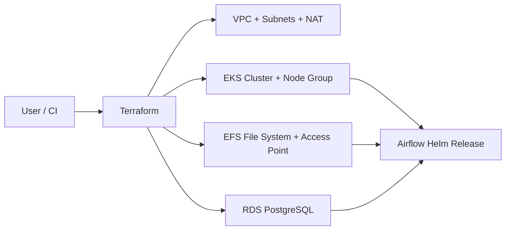

# Airflow on EKS

This repository provisions an Amazon EKS cluster and deploys Apache Airflow on top of it using Terraform and the official Airflow Helm chart. The infrastructure includes a custom VPC, managed node group, EFS storage, PostgreSQL RDS, and Kubernetes add-ons required for the cluster runtime.

## Architecture



The deployment is driven from the `terraform/` directory and uses the following stack:

- VPC with public and private subnets
- Amazon EKS cluster and managed node group
- AWS EKS add-ons for VPC CNI, Kube Proxy, and CoreDNS
- Amazon EFS for shared DAG storage / persistence
- Amazon RDS for PostgreSQL metadata database
- Airflow Helm release using `KubernetesExecutor`

## Repository layout

```text
.
├── README.md
├── dags/
│   ├── etl_pipeline_demo.py
│   ├── etl_pipeline.py
│   ├── hello_world.py
│   └── python_task_demo.py
├── scripts/
│   ├── deploy.sh
│   ├── destroy.sh
│   └── local-validate.sh
└── terraform/
    ├── airflow.tf
    ├── backend.tf
    ├── efs.tf
    ├── eks.tf
    ├── main.tf
    ├── outputs.tf
    ├── providers.tf
    ├── rds.tf
    ├── security-group.tf
    ├── variables.tf
    ├── vpc.tf
    ├── envs/
    │   └── dev.tfvars
    └── modules/
        ├── addons/
        ├── airflow/
        ├── efs/
        ├── eks/
        ├── rds/
        └── vpc/
```

## Prerequisites

Before running this repository, make sure you have:

- Terraform `>= 1.5.0`
- AWS CLI configured with credentials and permissions for:
  - VPC
  - EKS
  - IAM
  - EFS
  - RDS
  - CloudWatch / EKS add-ons
- `kubectl` installed and configured
- Helm installed
- A remote Terraform backend configured for state storage and locking (S3 + DynamoDB lock table)

This repo intentionally leaves the remote backend configuration commented out in `terraform/backend.tf` to avoid committing environment-specific values.

## Required configuration

The Terraform root variables are defined in `terraform/variables.tf`.

Key variables include:

- `aws_region`
- `profile`
- `environment`
- `cluster_name`
- `kubernetes_version`
- `vpc_cidr`
- `availability_zones`
- `private_subnet_cidrs`
- `public_subnet_cidrs`
- `node_instance_types`
- `desired_nodes`, `min_nodes`, `max_nodes`
- `database_name`, `database_user`, `database_password`
- `rds_instance_class`, `rds_allocated_storage`

The environment-specific values for the default dev setup are stored in `terraform/envs/dev.tfvars`.

Example configuration:

```hcl
aws_region           = "eu-central-1"
profile              = "airflow"
environment          = "dev"
cluster_name         = "airflow-cluster"
kubernetes_version   = "1.29"
vpc_cidr             = "10.20.0.0/16"
availability_zones   = ["eu-central-1a", "eu-central-1b"]
private_subnet_cidrs = ["10.20.1.0/24", "10.20.2.0/24"]
public_subnet_cidrs  = ["10.20.101.0/24", "10.20.102.0/24"]
node_instance_types  = ["t3.medium"]
desired_nodes        = 2
min_nodes            = 1
max_nodes            = 3
rds_instance_class   = "db.t3.micro"
rds_allocated_storage = 20
database_name        = "airflow"
database_user        = "airflow_admin"
database_password    = "change-me-before-apply"
```

Important:

- Do not commit real database secrets to version control.
- The sample `database_password` in `dev.tfvars` is a placeholder and must be replaced.
- If you are using a remote backend, uncomment and configure `terraform/backend.tf` before `terraform init`.

## Deployment

The repo includes helper scripts to deploy and destroy the environment.

### Deploy

```bash
./scripts/deploy.sh dev
```

This script does the following:

1. Validates that the environment file exists in `terraform/envs/`
2. Runs `terraform init` with the environment-specific state key
3. Runs `terraform apply -var-file=terraform/envs/dev.tfvars`

Additional Terraform arguments can be passed through, for example:

```bash
./scripts/deploy.sh dev -auto-approve
```

### Destroy

```bash
./scripts/destroy.sh dev
```

This removes the deployed environment using the same tfvars file.

## Local validation

The repository also contains a lightweight validation script:

```bash
./scripts/local-validate.sh
```

This script checks the Terraform configuration without using a remote backend:

```bash
terraform -chdir=terraform init -backend=false
terraform -chdir=terraform validate
terraform -chdir=terraform plan -var-file=envs/dev.tfvars -lock=false -input=false -refresh=false
```

This is useful as a sanity check before the full deployment.

## What gets created

The Terraform root configuration wires together several modules:

- `terraform/vpc.tf` creates the VPC, public/private subnets, Internet Gateway, and NAT gateway
- `terraform/eks.tf` creates the EKS cluster and node group
- `terraform/efs.tf` creates EFS and access point resources
- `terraform/rds.tf` creates the PostgreSQL instance in private subnets
- `terraform/airflow.tf` installs the Airflow Helm chart in a Kubernetes namespace
- `terraform/modules/addons` installs EKS add-ons

Airflow is configured with:

- `executor: KubernetesExecutor`
- `postgresql.enabled = false`
- `redis.enabled = false`
- Metadata database set to the RDS PostgreSQL instance
- DAG persistence enabled with the storage class name `efs-sc`

## Accessing the cluster and Airflow

After deployment, use the EKS cluster details from Terraform output or the AWS console to connect:

```bash
aws eks update-kubeconfig --region eu-central-1 --name airflow-cluster --profile airflow
kubectl get nodes
kubectl get pods -n airflow
kubectl get svc -n airflow
```

The Airflow release is installed under the `airflow` namespace by default.

## Outputs

The configuration exposes several outputs from `terraform/outputs.tf`:

- `cluster_name`
- `cluster_endpoint`
- `vpc_id`
- `rds_endpoint`
- `efs_file_system_id`

You can inspect them with:

```bash
terraform -chdir=terraform output
```

## Important caveats

This repository is a useful baseline but has a few deployment caveats that should be reviewed before production use:

1. The remote backend configuration is commented out in `terraform/backend.tf` and must be enabled in your environment.
2. The sample `database_password` value in `terraform/envs/dev.tfvars` is a placeholder and must be changed.
3. The repo currently defines only the `dev` environment file; there is no `prod.tfvars` in the checked-in workspace.
4. The Airflow Helm chart references a storage class named `efs-sc` in `terraform/modules/airflow/main.tf`. That storage class must exist in the cluster, or the value must be adjusted to match your Kubernetes storage configuration.
5. The repo currently provisions EFS and RDS but the EFS CSI driver and StorageClass configuration are not defined in the Terraform modules themselves. You may need to add or pre-create the matching storage class manually.
6. The VPC uses one NAT gateway and is intentionally minimal, which is suitable for a small environment but should be reviewed for production workloads.

## Suggested next steps

- Replace the sample credentials and backend values with your real environment settings.
- Review IAM permissions and security groups for production readiness.
- Add a proper EFS CSI storage class if you want Airflow DAG persistence to mount cleanly through Kubernetes.
- Add a `prod.tfvars` file and production-safe backend configuration if you want to mirror this environment across multiple stages.

## Notes

This project is provisioned as a demonstration / starter pattern for running Airflow in AWS EKS with managed AWS services. It is a solid foundation for experimentation and a starting point for more production-grade hardening such as:

- separate IAM roles and policies for workloads
- secret management via AWS Secrets Manager / External Secrets
- private ingress and TLS for the Airflow web UI
- backup and retention strategies for PostgreSQL and EFS
- observability and monitoring with Prometheus / Grafana / CloudWatch
