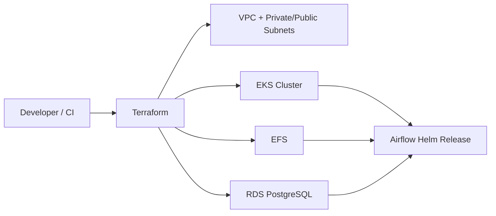

# Apache Airflow on Amazon EKS

A Kubernetes-focused reference implementation for deploying **Apache Airflow on Amazon EKS** with Terraform and the official Airflow Helm chart.

> **Focus:** EKS · Kubernetes · Terraform · EFS · RDS PostgreSQL · Helm · AWS security

## Architecture



## What this project demonstrates

- AWS EKS cluster provisioning with Terraform
- Multi-AZ VPC and managed node groups
- EKS add-ons including VPC CNI, CoreDNS and kube-proxy
- Apache Airflow deployment through Helm
- KubernetesExecutor configuration
- Amazon EFS for shared DAG persistence
- Amazon RDS PostgreSQL for Airflow metadata
- AWS Secrets Manager integration for database credentials
- Terraform modules and environment-specific variables
- Deployment and validation helper scripts

## Repository structure

```text
.
├── dags/                     Example Airflow DAGs
├── scripts/                  Deploy, destroy and validation scripts
└── terraform/
    ├── modules/              Reusable VPC, EKS, EFS, RDS, addons and Airflow modules
    ├── envs/                 Environment-specific variables
    ├── airflow.tf             Airflow Helm release
    ├── eks.tf                 EKS resources
    ├── efs.tf                 EFS resources
    ├── rds.tf                 PostgreSQL resources
    ├── vpc.tf                 Networking
    └── outputs.tf             Deployment outputs
```

## Prerequisites

- Terraform >= 1.5
- AWS CLI
- `kubectl`
- Helm
- AWS credentials with permissions for VPC, EKS, IAM, EFS and RDS
- A remote Terraform backend for shared environments

## Deploy

Review `terraform/envs/dev.tfvars` and authenticate to AWS, then:

```bash
./scripts/deploy.sh dev
```

Validate the Terraform configuration locally:

```bash
./scripts/local-validate.sh
```

Connect to the cluster:

```bash
aws eks update-kubeconfig --region eu-central-1 --name airflow-cluster --profile airflow
kubectl get nodes
kubectl get pods -n airflow
```

Destroy the environment when it is no longer needed:

```bash
./scripts/destroy.sh dev
```

## Security

- Database credentials are generated and stored in AWS Secrets Manager by default.
- Do not commit real secrets or credentials to `*.tfvars` files.
- Use least-privilege IAM policies for Terraform and workloads.
- Use an encrypted remote backend for shared Terraform state.
- Prefer short-lived/federated AWS credentials for CI/CD.
- Review security groups, network paths and public exposure before production use.

## Production considerations

This repository is a reference implementation rather than a turnkey production platform. Before production use, review the EFS CSI driver and StorageClass configuration, backend locking/state controls, private ingress/TLS, RDS backups and encryption, workload IAM, observability, resource requests/limits and environment separation.

## Technologies

**Cloud:** AWS EKS · VPC · EFS · RDS · Secrets Manager  
**Kubernetes:** Kubernetes · Helm · KubernetesExecutor  
**IaC:** Terraform  
**Orchestration:** Apache Airflow

## Author

**Vitalis Ibekwe**  
Cloud · Platform · SRE · DevOps Engineer

GitHub: https://github.com/VitalisCode
